# Uzo Food Tracking

A mobile-first PWA for tracking food inventory, recipes, and daily meal logging. Data is stored in Supabase, with optional AI-assisted recipe generation via OpenRouter.

## Features
- **Food Inventory Management:** Track pantry items with nutrition facts, stock status, and personal ratings
- **Advanced Search:** Full-text search across items with rich filtering and tag-based organization
- **Recipe Management:** Create and organize recipes with automatic nutrition calculations
- **Meal Logging:** Track daily meals with automatic nutrition aggregation
- **Analytics Dashboard:** Visualize nutrition trends and consumption statistics over time
- **AI Recipe Generation:** Get recipe suggestions based on available ingredients via OpenRouter integration
- **Settings & Preferences:** Configure personal nutrition goals and app preferences
- **PWA Support:** Installable progressive web app with offline asset caching
- **Mobile-First Design:** Responsive touch-optimized interface designed for mobile devices

## Tech Stack
- **Frontend:** React 18, TypeScript, Vite
- **UI Framework:** shadcn/ui (Radix UI primitives) + Tailwind CSS with mobile-first responsive design
- **State Management:** TanStack Query (React Query v5) for server state
- **Backend:** Supabase (PostgreSQL with migrations, RPC functions, RLS policies)
- **AI Integration:** OpenRouter API for recipe generation
- **PWA:** vite-plugin-pwa with offline asset caching and service worker
- **Testing:** Vitest + Testing Library for unit tests; Playwright for E2E testing
- **Documentation:** OpenAPI 3.1 specification with validation tools

## Getting Started
1. Create a `.env` file in the project root from the `.env.example` file:
   ```env
   VITE_SUPABASE_URL=your-supabase-url
   VITE_SUPABASE_ANON_KEY=your-supabase-anon-or-publishable-key
   # Optional: required for AI features
   VITE_OPEN_ROUTER_API_KEY=your-openrouter-api-key
   # Optional: restrict sign-in to a specific email (defaults to owner)
   VITE_ALLOWED_EMAIL=you@example.com
   ```
2. Install dependencies
   ```sh
   npm install
   ```
3. Start the dev server
   ```sh
   npm run dev
   ```
   The application runs at `http://localhost:8080`.

## Database Setup (Supabase)
1. Create a Supabase project at [supabase.com](https://supabase.com)
2. Run migration files in chronological order from `supabase/migrations/*.sql` using the Supabase SQL editor
3. The migrations will create tables, RPC functions, RLS policies, and analytics cache system
4. Optionally seed sample data using `supabase/seed.sql`

**Key Database Features:**
- Row Level Security (RLS) policies for multi-user support
- Full-text search vectors for item search
- Automated cost calculation triggers
- Analytics caching for performance
- Bulk insert RPC functions for efficiency

## Testing
- **Unit/Component (Vitest):**
  - `npm test`: Run tests in watch mode
  - `npm run test:run`: Run tests once
  - `npm run test:ui`: Open the Vitest UI
- **End-to-End (Playwright):**
  - `npm run test:e2e`: Run E2E tests
  - `npm run test:e2e:ui`: Open the Playwright UI
- **Linting:**
  - `npm run lint`: Run ESLint
- **OpenAPI Validation:**
  - `npm run oas:validate`: Validate OpenAPI spec
  - `npm run oas:lint`: Lint OpenAPI spec with Redocly
  - `npm run oas:spectral`: Lint with Spectral
  - `npm run oas:all`: Run all OpenAPI checks

## Project Structure
```
├─ src/
│  ├─ pages/         # Main application pages
│  │  ├─ Index.tsx           # Food inventory management (home page)
│  │  ├─ Recipes.tsx         # Recipe library
│  │  ├─ RecipeViewer.tsx    # Individual recipe view
│  │  ├─ Meals.tsx           # Meal logging interface
│  │  ├─ Analytics.tsx       # Analytics dashboard
│  │  ├─ Tags.tsx            # Tag management
│  │  ├─ Settings.tsx        # User preferences
│  │  └─ AuthCallback.tsx    # Supabase auth callback
│  ├─ components/    # UI components
│  │  ├─ ui/         # shadcn/ui component library
│  │  └─ [various]   # Domain-specific dialogs, cards, forms
│  ├─ hooks/         # Custom React hooks
│  │  ├─ useMealLogs.ts      # Meal logging operations
│  │  ├─ useRecipes.ts       # Recipe CRUD operations
│  │  ├─ useTags.ts          # Tag management
│  │  ├─ useInventorySearch.ts # Inventory search & filters
│  │  └─ [others]            # Various utility hooks
│  ├─ lib/           # Core utilities
│  │  ├─ supabase.ts         # Supabase client configuration
│  │  ├─ openrouter.ts       # OpenRouter AI client
│  │  ├─ calculations.ts     # Recipe cost & nutrition calculations
│  │  ├─ typeMappers.ts      # DB to app type conversions
│  │  ├─ logger.ts           # Centralized logging
│  │  └─ [others]            # Constants, validators, utilities
│  └─ types/         # TypeScript definitions
├─ tests/            # Playwright E2E tests
├─ src/tests/        # Vitest unit tests
├─ supabase/         # Database files
│  ├─ migrations/    # SQL migrations (chronological order)
│  └─ seed.sql       # Sample data for testing
├─ docs/             # Documentation
│  ├─ openapi-3.1.yaml       # API specification
│  └─ [guides]               # Technical guides
├─ product-requirements/      # Design documents
├─ claudedocs/       # Claude Code analysis reports
└─ public/           # Static assets
   ├─ pwa-*.png      # PWA icons
   └─ screenshots/   # App screenshots for README
```

**Development Notes:**
- Path alias: `@` maps to `./src` (configured in `tsconfig.json`)
- Mobile utilities: `use-mobile.tsx` hook for responsive breakpoint logic
- Type safety: Separate DB types from app types for clean abstractions
- Testing: Unit tests colocated in `src/tests/`, E2E tests in `tests/`

## Deployment
Build a production bundle:
```sh
npm run build
```

Preview builds locally:
```sh
npm run preview       # Default mode
npm run preview:dev   # Development mode
npm run preview:prod  # Production mode
```

The PWA service worker automatically registers in production builds (via `vite-plugin-pwa`).

## AI Recipe Generation

The app includes AI-powered recipe generation using OpenRouter's API:

**Setup:**
1. Get an API key from [OpenRouter](https://openrouter.ai/)
2. Add `VITE_OPEN_ROUTER_API_KEY` to your `.env` file
3. The AI recipe generator will appear in the Recipes page

**Features:**
- Generate recipes from available inventory items
- Specify servings, cuisine style, and dietary restrictions
- Preview generated recipes before saving
- Automatic ingredient mapping to inventory items
- Graceful fallback if API key is not configured

**Implementation:**
- `src/components/RecipeGeneratorDialog.tsx` - Main UI interface
- `src/lib/openrouter.ts` - API client with error handling
- `src/lib/aiJson.ts` - Response parsing and validation

The app works fully without an API key; AI features simply won't be available.

## Screenshots

### Inventory Management
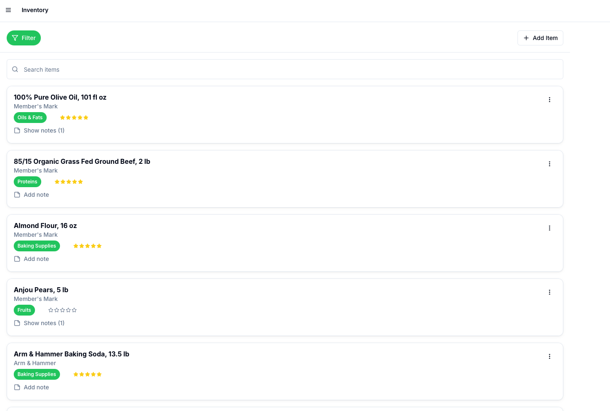 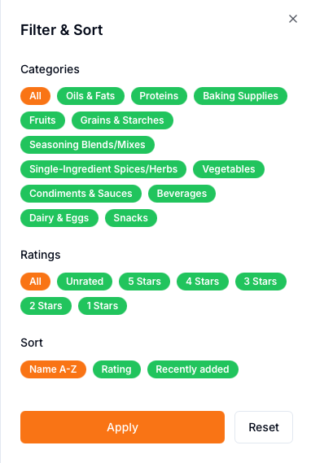 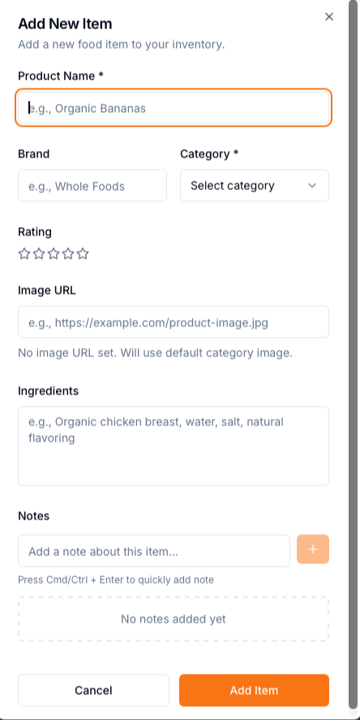

### Recipe Management
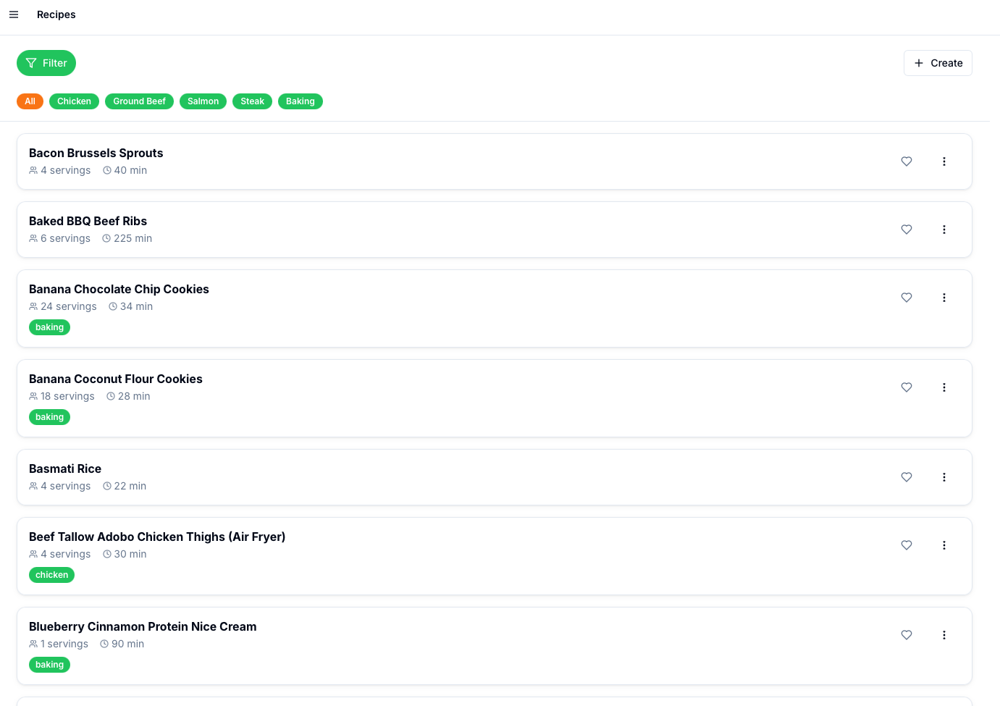 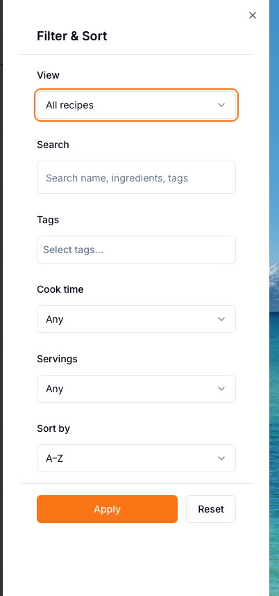 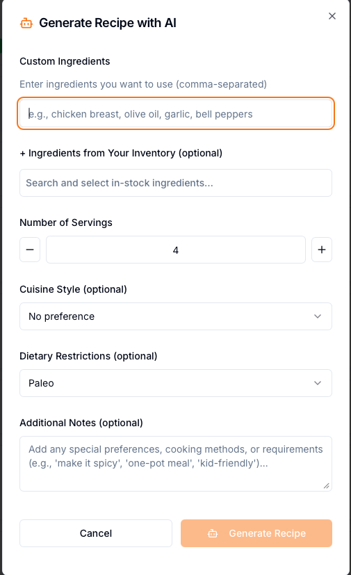

### Meal Logging
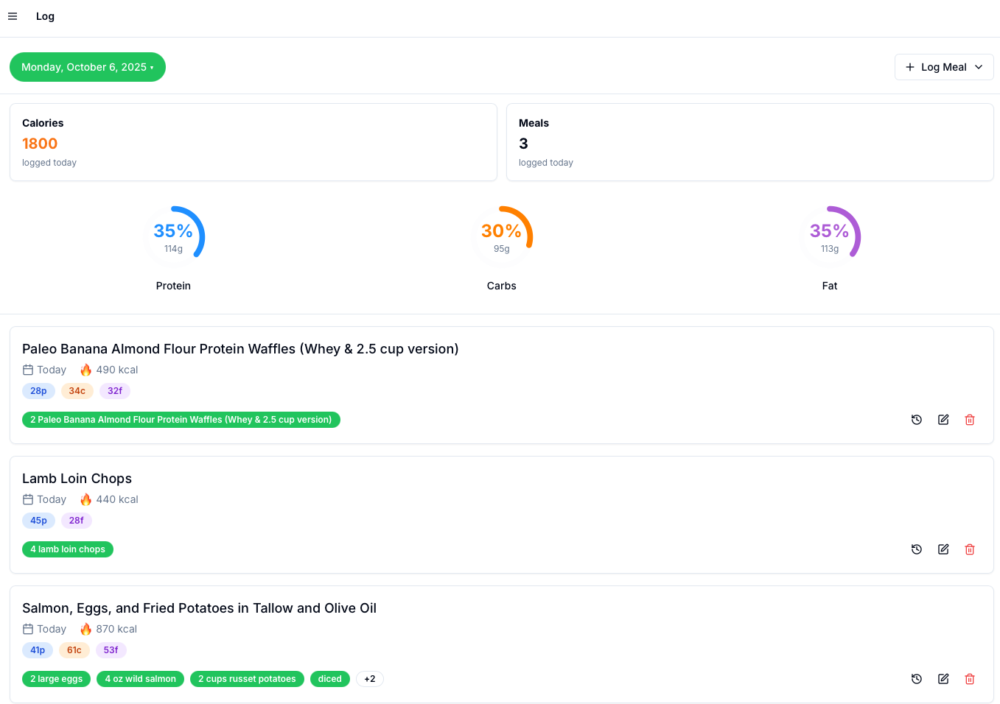  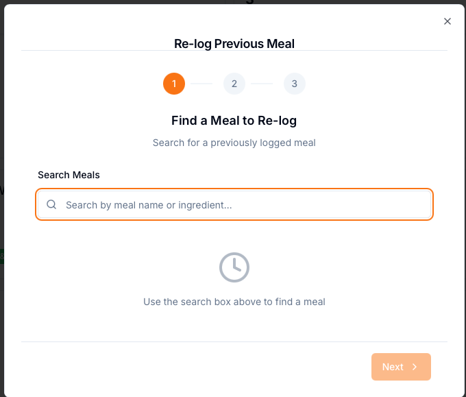

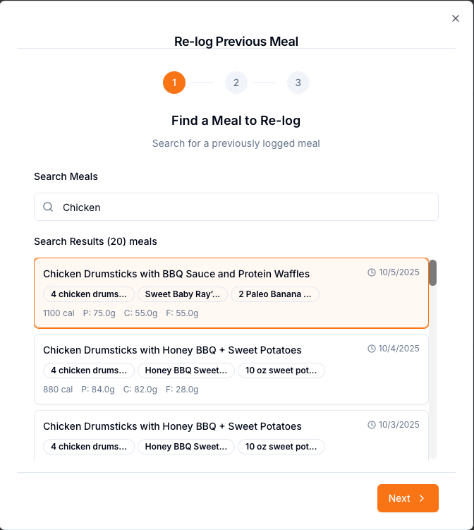 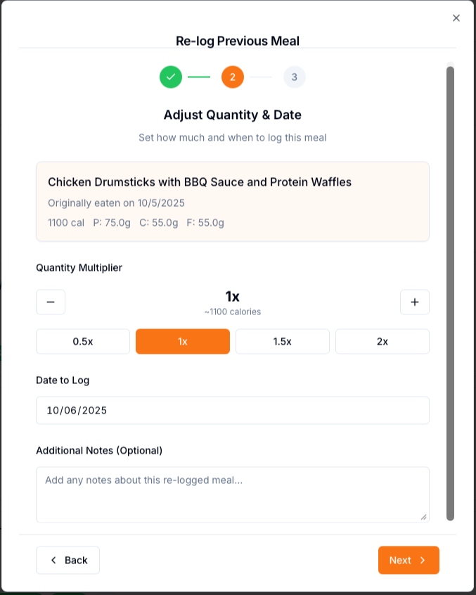 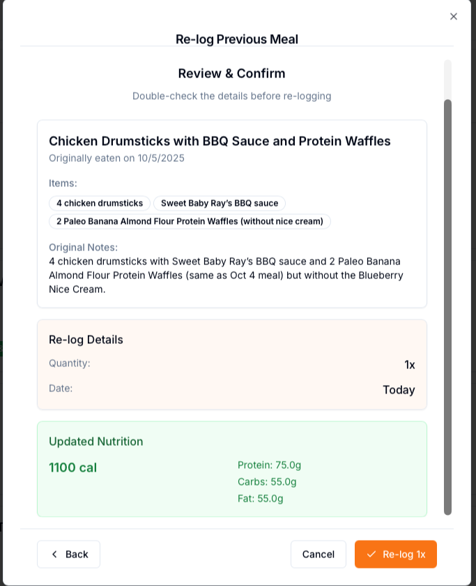

### Analytics Dashboard
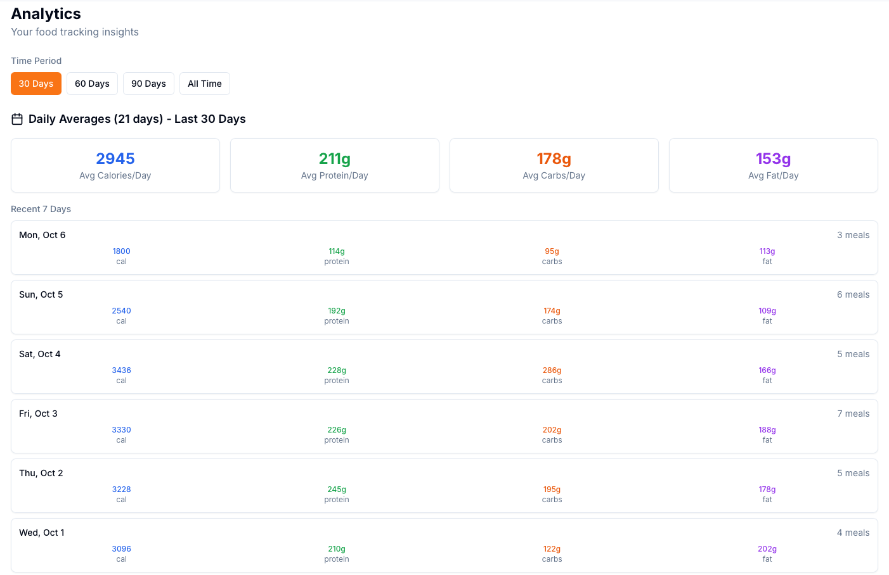 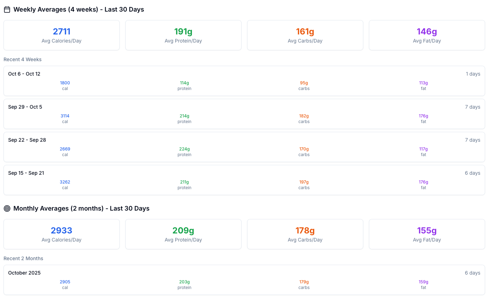 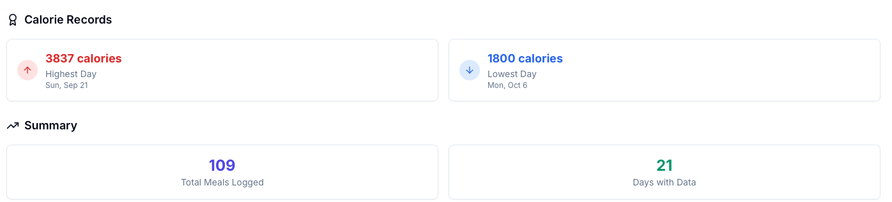

### Settings
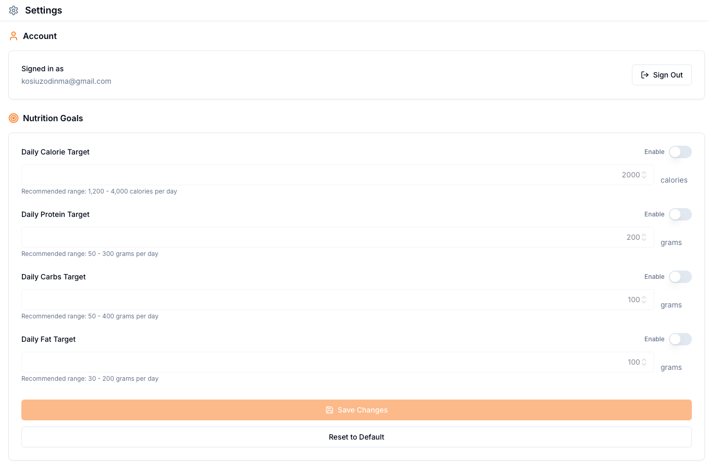

---

**PWA Assets:** `public/pwa-192x192.png`, `public/pwa-512x512.png`
